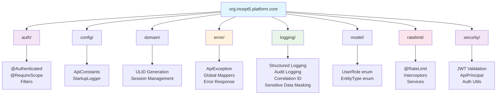
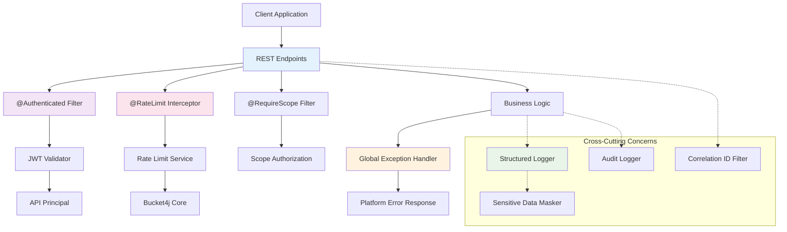
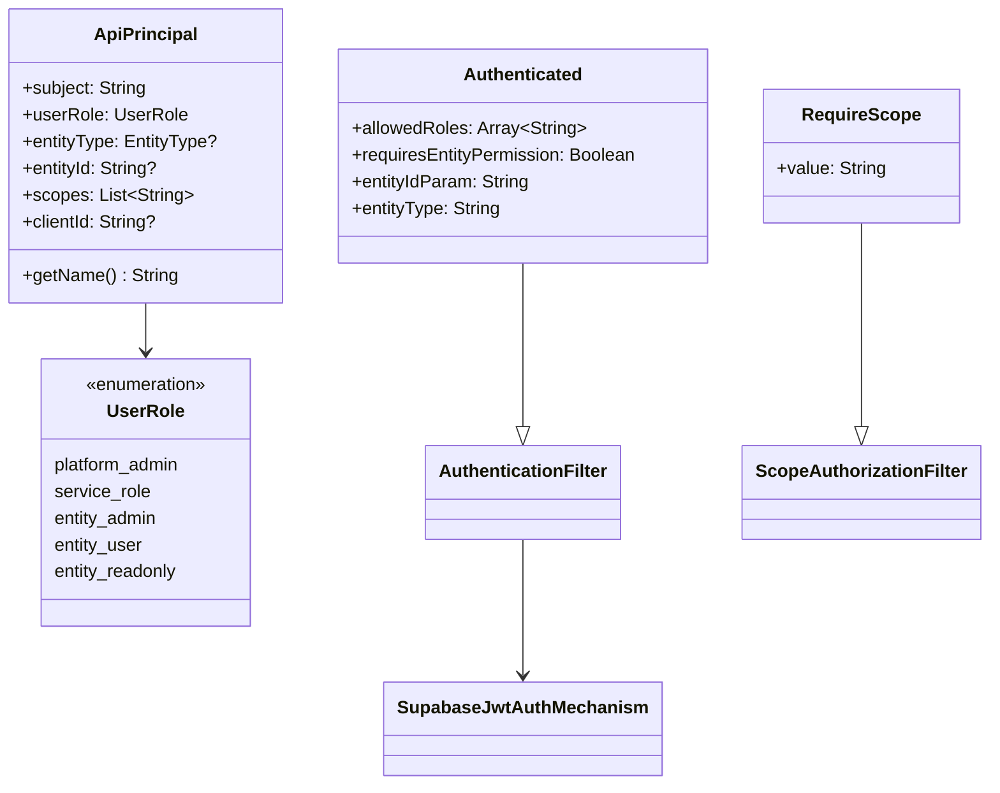
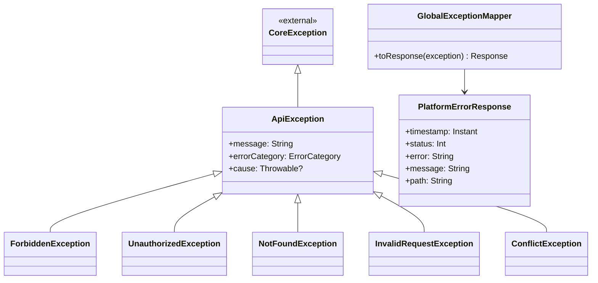
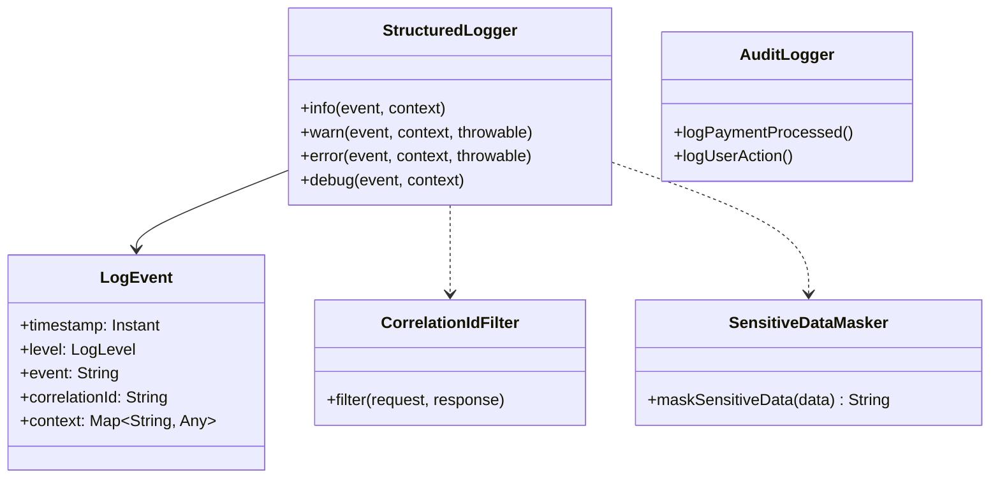

# Platform Core Library Architecture

## System Overview

The Platform Core Library is a **reusable Kotlin library** designed for **Quarkus applications** that provides **platform-level utilities and components**. It serves as a foundational layer for enterprise applications requiring authentication, security, logging, error handling, and rate limiting capabilities.

## Technologies

### Runtime & Framework
- **Language**: Kotlin 2.1.0 targeting JVM 21
- **Framework**: Quarkus 3.22.2 (Enterprise Java with CDI, JAX-RS)
- **Build Tool**: Gradle 8.13 with Kotlin DSL
- **Distribution**: JitPack for Maven publishing

### Core Dependencies
- **Authentication**: JWT validation (java-jwt 4.4.0)
- **ID Generation**: ULID Creator 5.2.2
- **Rate Limiting**: Bucket4j 8.7.0
- **HTTP Logging**: Zalando Logbook 3.10.0
- **Reactive HTTP**: Spring WebFlux 6.2.6, Reactor Netty 1.2.5
- **Cryptography**: BCrypt 0.10.2, Apache Commons Codec 1.16.0
- **JSON Processing**: Jackson with Kotlin module
- **Testing**: JUnit 5, Kotest 5.8.0, Mockito Kotlin 5.2.1

### External Incept5 Libraries
- **Incept5 Correlation** (1.0.20): Request correlation utilities
- **Incept5 Error Library** (1.0.26): Quarkus error handling extensions  
- **Incept5 Cryptography** (1.0.28): Cryptographic utilities

## Package Architecture



## High-Level Architecture



## Key Components

### Authentication & Authorization System



### Error Handling System



### Logging Architecture



## Design Principles

### ✅ What's Included (Platform-Level Concerns)
- **Cross-cutting concerns**: Logging, correlation, error handling
- **Authentication & security infrastructure**: JWT validation, filters
- **Shared configuration and utilities**: Startup logging, constants
- **Common domain utilities**: ID generation, validation, session management
- **Platform-level components**: Reusable across multiple applications

### ❌ What's Excluded (Application-Specific)
- **Business domain logic**: Payment, Partner, Merchant specific code
- **Application-specific utilities**: Domain-specific business rules
- **Database entities**: Except base classes and utilities
- **API endpoints or controllers**: Business logic implementations
- **Infrastructure concerns**: Deployment, environment-specific configuration

## Integration Patterns

### CDI Integration
- All components use `@ApplicationScoped` for singleton lifecycle
- Standard `@Inject` dependency injection
- Automatic bean discovery via Jandex indexing
- Quarkus `@NameBinding` for authentication/authorization filters

### Annotation-Driven Configuration
- `@Authenticated` for endpoint security
- `@RequireScope` for granular permission control
- `@RateLimit` for traffic management
- Declarative, minimal configuration approach

### Error Handling Strategy
- Global exception mappers for consistent error responses
- Structured error responses with correlation IDs
- Integration with external Incept5 error handling library
- Comprehensive exception hierarchy for different error scenarios

## Build & Distribution

### Publishing Strategy
- **JitPack Distribution**: `com.github.incept5:platform-core-lib`
- **Automated CI/CD**: GitHub Actions with version tagging
- **Version Strategy**: `1.0.<build-number>` for releases, `1.0.0-SNAPSHOT` for development
- **Maven Repository**: Published to JitPack for public consumption

### Quality Assurance
- **Testing**: JUnit 5 + Kotest for comprehensive test coverage
- **Build Validation**: Gradle build with dependency validation
- **CDI Bean Discovery**: Jandex index generation for runtime efficiency
- **Compatibility**: Java 21+ runtime requirement

## Dependencies Strategy

### Core Platform Dependencies (API Scope)
```kotlin
// Exposes Quarkus platform capabilities to consumers
api("io.quarkus:quarkus-core")
api("io.quarkus:quarkus-hibernate-orm-panache-kotlin")
api("io.quarkus:quarkus-smallrye-jwt")
api("io.quarkus:quarkus-rest-jackson")
```

### Utility Libraries (API Scope)
```kotlin
// ULID generation, JWT handling, rate limiting
api("com.github.f4b6a3:ulid-creator")
api("com.auth0:java-jwt") 
api("com.bucket4j:bucket4j-core")
```

### External Incept5 Libraries
```kotlin
// Platform-specific extensions
api("com.github.incept5:correlation")
api("com.github.incept5.error-lib:error-quarkus") 
api("com.github.incept5.cryptography-lib:cryptography-quarkus")
```

## Usage Examples

### Authentication Setup
```kotlin
@RestController
@Path("/api/secure")
class SecureController {
    
    @GET
    @Authenticated(allowedRoles = ["entity_admin", "platform_admin"])
    @RequireScope("resource:read")
    fun getSecureData(principal: ApiPrincipal): Response {
        // Automatic authentication + authorization
        return Response.ok(secureData).build()
    }
}
```

### Structured Logging
```kotlin
@ApplicationScoped
class BusinessService {
    @Inject lateinit var logger: StructuredLogger
    @Inject lateinit var auditLogger: AuditLogger
    
    fun processPayment(payment: Payment) {
        logger.info("payment.processing.started") {
            put("paymentId", payment.id)
            put("amount", payment.amount)
        }
        // Business logic
        auditLogger.logPaymentProcessed(payment.id, payment.amount)
    }
}
```

### ID Generation
```kotlin
val orderId = UlidGenerator.generateWithPrefix("ORDER")
val sessionId = SessionIdGenerator.generate()
```

*Last updated: 29 August 2025 - Initial architecture documentation based on comprehensive codebase analysis*
